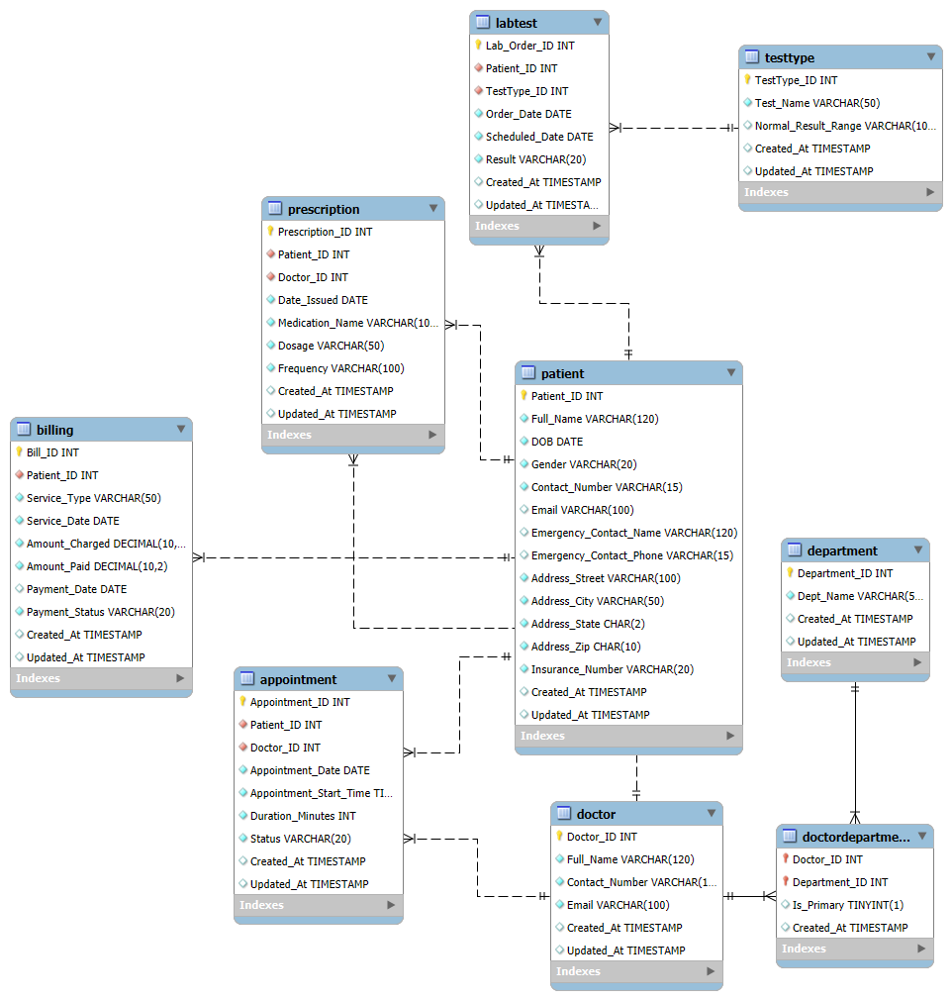

# Hospital Management Database Analysis

## Purpose
This SQL database project simulates real-world hospital reporting needs for analytical practice.

## Database Structure
### Core Tables
| Table | Description |
|-------|-------------|
| `Patient` | Stores demographic, contact, and insurance information |
| `Doctor` | Contains provider details and contact information |
| `Appointment` | Tracks scheduled visits with status (Scheduled/Completed/Canceled) along with generic appointment information |
| `LabTest` | Stores test orders and results (Normal/Abnormal/Pending) |
| `Billing` | Stores financial transactions and payment status |

## Entity Relationship Diagram
  

## Analysis Files
### `patient_analytics.sql`
- Patient age distribution analysis
- Geographic concentration by ZIP code
- Insurance plan coverage statistics
- No-show and cancellation rates

### `financial_analysis.sql`
- Monthly revenue trends with growth calculations
- Payer mix analysis (commercial vs. government insurance)
- Outstanding balances by patient age group
- Service line profitability

### `operational_analysis.sql`
- Appointment volume by department
- Lab test turnaround times
- Prescription patterns

## Next Steps

### Data Improvements
- Improve and expand dataset
- Optimize queries

### Query Enhancements
- Create new hospital-informing queries

### Visualization Pipeline
1. **Tableau/Power BI**:
   - Executive dashboard
   - Department scorecards
2. **Data Export**:
   - Scheduled CSV extracts
   - Python API for real-time access
